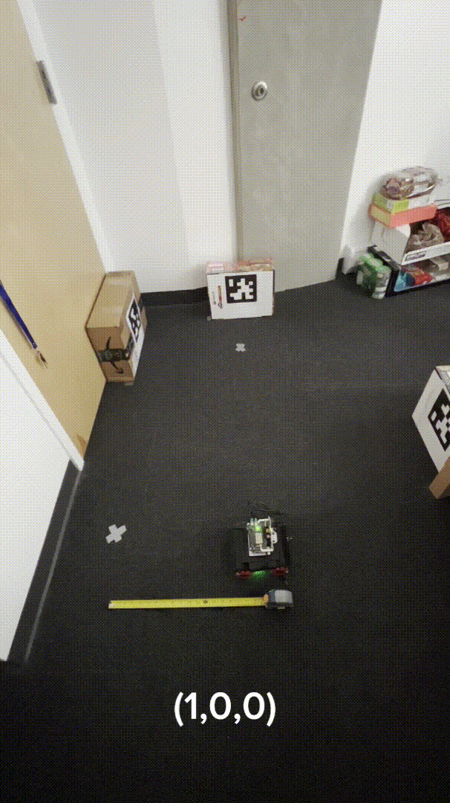

# rb5_roomba
A Roomba-like robot based on the Qualcomm Robotics RB5 platform.

 ## Overview 

This repository contains the code and resources for a Roomba-like robot developed as part of the UCSD CSE276A course assignment. The project leverages the Qualcomm Robotics RB5 platform and implements landmark-based Simultaneous Localization and Mapping (SLAM), robot control, and comprehensive coverage in unknown environments. The robot's chassis drive module is derived from the [Autonomous Vehicle Laboratory's RB5 ROS repository](https://github.com/AutonomousVehicleLaboratory/rb5_ros). 

### Features 

- **Robot Control**: Efficient control mechanisms for navigation. 
- **Effective Path Planning**: Advanced algorithms for optimizing travel paths in real-time.
- **Landmark-Based SLAM**: Utilizes landmarks for accurate mapping and localization.
- **Unknown Environment Exploration**: Algorithms to cover and map unknown areas effectively.

## Demonstrations

### Calibrated Open Loop Control

### Closed Loop Control

### Apriltag Based SLAM

### Path Planning & Navigation

